# Algotrading System — DAG Knowledge Graph & Architectural Workflow

## Layer Map

```
Layer 8: ORCHESTRATION ───── scripts/orchestrate.py, trading_orchestrator.py
Layer 7: ALERTS ──────────── Telegram bot, REST API (8080)
Layer 6: RISK ────────────── Portfolio monitor, position sizer, leverage mgmt
Layer 5: SIGNAL BUS ──────── shared_config/*.json (filesystem IPC)
Layer 4: DATA VENDORS ────── yfinance, Alpha Vantage, Binance API
Layer 3: SWARM ───────────── MiroFish sentiment (port 3000/5001)
Layer 2: LLM AGENTS ──────── TradingAgents (13 agents, 19 models, LangGraph)
Layer 1: TRADING ENGINE ──── Freqtrade + FreqAI (ML models)
Layer 0: INFRA ───────────── Docker, Redis, PostgreSQL
```

---

## Complete DAG: Node-by-Node Workflow

```mermaid
flowchart TD
    %% ── LAYER 0: INFRASTRUCTURE ──
    subgraph L0["Layer 0: Infrastructure"]
        DOCKER["Docker Compose<br/>docker-compose.unified.yml"]
        REDIS["Redis<br/>port 6379<br/>Cache / PubSub"]
        PG["PostgreSQL<br/>port 5432<br/>Trade DB"]
    end

    %% ── LAYER 1: TRADING ENGINE ──
    subgraph L1["Layer 1: Core Trading Engine"]
        FT["Freqtrade<br/>port 8080<br/>Strategy: AroonMomentumEngine_Hybrid"]
        FREQAI["FreqAI ML Layer<br/>XGBoost | LightGBM | PyTorch | RL<br/>GPU/CUDA optional"]
        FTDB["SQLite DB<br/>user_data/tradesv3.sqlite"]
    end

    %% ── LAYER 2: LLM AGENTS ──
    subgraph L2["Layer 2: LLM Multi-Agent System (TradingAgents)"]
        direction TB
        TA_MAIN["TradingAgentsGraph<br/>LangGraph StateGraph<br/>Checkpoint: SqliteSaver"]

        subgraph ANALYSTS["Phase A: Analysts (Sequential)"]
            A1["① Market Analyst<br/>Model: gemini-3-flash-preview<br/>Tools: get_stock_data, get_indicators"]
            A2["② Social/Sentiment Analyst<br/>Model: kimi-k2.6<br/>Tool: get_news"]
            A3["③ News Analyst<br/>Model: qwen3.5:397b<br/>Tools: get_news, get_global_news, get_insider_transactions"]
            A4["④ Fundamentals Analyst<br/>Model: deepseek-v4-pro<br/>Tools: get_fundamentals, get_balance_sheet, get_cashflow, get_income_statement"]
            A5["⑤ MiroFish Analyst<br/>Model: kimi-k2.5<br/>Reads: sentiment_signal.json"]
        end

        subgraph DEBATE["Phase B: Bull/Bear Debate (Loop max=1)"]
            BULL["Bull Researcher<br/>Model: cogito-2.1:671b"]
            BEAR["Bear Researcher<br/>Model: mistral-large-3:675b"]
            RM["Research Manager<br/>Model: kimi-k2.6<br/>Synthesizes debate → Investment Plan"]
        end

        TRADER_NODE["Phase C: Trader<br/>Model: qwen3-coder:480b<br/>Converts plan → structured trade"]

        subgraph RISK_DEBATE["Phase D: Risk Debate (Loop max=1)"]
            AGGR["Aggressive Risk<br/>Model: deepseek-v4-flash"]
            NEUTRAL["Neutral Risk<br/>Model: glm-5.1"]
            CONS["Conservative Risk<br/>Model: devstral-2:123b"]
        end

        PM["Phase E: Portfolio Manager<br/>Model: kimi-k2.6<br/>Final decision: Buy/Overweight/Hold/Underweight/Sell"]

        MEMORY["TradingMemoryLog<br/>Stores decisions + outcomes<br/>Re-injected as past_context"]
        REFLECTOR["Reflector (LLM)<br/>Deferred outcome analysis<br/>Resolved on next same-ticker run"]
    end

    %% ── LAYER 3: SWARM ──
    subgraph L3["Layer 3: Swarm Intelligence"]
        MIROFISH["MiroFish<br/>port 3000 (API), 5001<br/>Swarm sentiment prediction"]
    end

    %% ── LAYER 4: DATA ──
    subgraph L4["Layer 4: Data Vendors"]
        YFINANCE["yfinance<br/>Stock, Fundamentals, News"]
        ALPHA_V["Alpha Vantage<br/>(optional)"]
        BINANCE["Binance API<br/>Exchange connectivity"]
    end

    %% ── LAYER 5: SIGNAL BUS ──
    subgraph L5["Layer 5: Signal Bus (Filesystem IPC)"]
        TA_SIG["tradingagents_signal.json<br/>{ticker, rating, reports, decision}"]
        SENT_SIG["sentiment_signal.json<br/>MiroFish swarm output"]
        LEV_SIG["leverage_signal.json<br/>Dynamic leverage config"]
        REG_SIG["market_regime.json<br/>Market state classification"]
    end

    %% ── LAYER 6: RISK MANAGEMENT ──
    subgraph L6["Layer 6: Risk Management"]
        MONITOR["Portfolio Monitor"]
        SIZER["Position Sizer"]
        DYN_LEV["Dynamic Leverage<br/>scripts/dynamic_leverage.py"]
        HEALTH["Health Monitor<br/>scripts/health_monitor.py"]
    end

    %% ── LAYER 7: ALERTS ──
    subgraph L7["Layer 7: Alerts & API"]
        TG_BOT["Telegram Alert Bot<br/>Circuit Breaker pattern"]
        FT_API["Freqtrade REST API<br/>port 8080"]
    end

    %% ── LAYER 8: ORCHESTRATION ──
    subgraph L8["Layer 8: Orchestration"]
        MASTER_ORCH["Master Orchestrator<br/>scripts/orchestrate.py<br/>5-phase startup sequence"]
        FT_ORCH["Fault-Tolerant Orchestrator<br/>scripts/trading_orchestrator.py<br/>Subprocess mgmt + auto-recovery"]
        SCHEDULER["TA Scheduler<br/>scripts/tradingagents_scheduler.py<br/>Interval-based (default: 600s)"]
        PROC_MGR["Process Manager<br/>PID lock + zombie cleanup"]
    end

    %% ── EDGES: Layer 8 → Layer 7 → Layer 1 → Layer 7 ──
    MASTER_ORCH --> FT_ORCH
    MASTER_ORCH --> TG_BOT
    MASTER_ORCH --> HEALTH
    FT_ORCH --> FT
    PROC_MGR --> FT
    HEALTH --> FT

    %% ── EDGES: Layer 1 Dependencies ──
    FT --> FREQAI
    FT --> FTDB
    FT --> FT_API
    DOCKER --> REDIS
    DOCKER --> PG
    FT --> REDIS
    FT --> PG

    %% ── EDGES: Layer 2 (LLM Agent DAG) ──
    SCHEDULER --> TA_MAIN
    TA_MAIN -->|"Sequential"| A1
    A1 -->|"loop: tool_calls?"| A1
    A1 -->|"MsgClear"| A2
    A2 -->|"loop: tool_calls?"| A2
    A2 -->|"MsgClear"| A3
    A3 -->|"loop: tool_calls?"| A3
    A3 -->|"MsgClear"| A4
    A4 -->|"loop: tool_calls?"| A4
    A4 -->|"MsgClear"| A5
    A5 -->|"loop"| A5
    A5 -->|"MsgClear"| BULL

    BULL -->|"count < max"| BEAR
    BEAR -->|"count < max"| BULL
    BULL -->|"count >= max"| RM
    BEAR -->|"count >= max"| RM

    RM --> TRADER_NODE

    TRADER_NODE --> AGGR
    AGGR -->|"round < max"| CONS
    CONS -->|"round < max"| NEUTRAL
    NEUTRAL -->|"round < max"| AGGR
    AGGR -->|"round >= max"| PM
    CONS -->|"round >= max"| PM
    NEUTRAL -->|"round >= max"| PM

    PM --> MEMORY
    PM --> TA_SIG

    MEMORY -->|"past_context"| TA_MAIN
    REFLECTOR --> MEMORY

    %% ── EDGES: Layer 2 Tool Calls → Layer 4 ──
    A1 --> YFINANCE
    A2 --> YFINANCE
    A3 --> YFINANCE
    A4 --> YFINANCE

    %% ── EDGES: Layer 3 → Layer 5 ──
    MIROFISH --> SENT_SIG
    A5 -.->|reads| SENT_SIG

    %% ── EDGES: Layer 5 → Layer 1 ──
    TA_SIG -.->|"ft_consumer polls"| FT
    LEV_SIG -.->|"applied"| FT
    REG_SIG -.->|"strategy context"| FT

    %% ── EDGES: Layer 6 ──
    MONITOR --> FT
    SIZER --> FT
    DYN_LEV --> LEV_SIG

    %% ── EDGES: Layer 1 → Layer 7 ──
    FT --> TG_BOT
```



---

## Node-Level Specification

### Layer 0 — Infrastructure

| Node | Type | Port | Storage | Dependencies |
|------|------|------|---------|-------------|
| **Docker Compose** | Orchestrator | — | — | BuildKit |
| **Redis** | Cache/Message Bus | 6379 | AOF (256MB max) | — |
| **PostgreSQL** | Relational DB | 5432 | Persistent volume | — |

### Layer 1 — Core Trading Engine

| Node | Type | Config | Key Detail |
|------|------|--------|------------|
| **Freqtrade** | Trading Bot | `config_unified.json` | Dry-run default, AroonMomentumEngine_Hybrid strategy |
| **FreqAI** | ML Layer | `freqai` config | XGBoost, LightGBM, PyTorch, RL; optional CUDA |
| **SQLite DB** | Local State | `tradesv3.sqlite` | Trade history, open trades, P&L |

### Layer 2 — LLM Multi-Agent System (TradingAgents)

**Entry**: `TradingAgentsGraph.propagate(ticker, date)`
**Framework**: LangGraph StateGraph
**Checkpoint**: `SqliteSaver` (per-ticker, resume on crash)
**Data Flow**: 19 models across 13 agent roles via Ollama API

#### Phase A — Analysts (Sequential)
Each analyst is an LLM node + ToolNode loop. The analyst calls tools until satisfied, then clears messages and passes to next.

| Node | Agent | Model | Tools | Output |
|------|-------|-------|-------|--------|
| ① Market | `market_analyst` | `gemini-3-flash-preview` | `get_stock_data`, `get_indicators` | `market_report` |
| ② Social | `sentiment_analyst` | `kimi-k2.6` | `get_news` | `sentiment_report` |
| ③ News | `news_analyst` | `qwen3.5:397b` | `get_news`, `get_global_news`, `get_insider_transactions` | `news_report` |
| ④ Fundamentals | `fundamentals_analyst` | `deepseek-v4-pro` | `get_fundamentals`, balance sheet, cashflow, income | `fundamentals_report` |
| ⑤ MiroFish | `mirofish_analyst` | `kimi-k2.5` | Reads `sentiment_signal.json` | `mirofish_report` |

**Conditional Edge**: Each analyst loops back to itself if the last message had `tool_calls`, else proceeds to `Msg Clear` → next analyst.

#### Phase B — Bull/Bear Debate (Loop)
| Node | Agent | Model | Role |
|------|-------|-------|------|
| Bull | `bull_researcher` | `cogito-2.1:671b` | Optimistic thesis |
| Bear | `bear_researcher` | `mistral-large-3:675b` | Critical/cautious thesis |
| Manager | `research_manager` | `kimi-k2.6` | Synthesizes → `investment_plan` |

**Conditional**: `should_continue_debate` — switches between Bull/Bear until `count >= 2 * max_debate_rounds` (default: 2), then goes to Research Manager.

#### Phase C — Trader
| Node | Agent | Model | Function |
|------|-------|-------|----------|
| Trader | `trader` | `qwen3-coder:480b` | Converts `investment_plan` → structured trade action |

#### Phase D — Risk Debate (Loop)
| Node | Agent | Model | Role |
|------|-------|-------|------|
| Aggressive | `aggressive_debator` | `deepseek-v4-flash` | Risk-tolerant assessment |
| Neutral | `neutral_debator` | `glm-5.1` | Balanced assessment |
| Conservative | `conservative_debator` | `devstral-2:123b` | Risk-averse assessment |

**Conditional**: `should_continue_risk_analysis` — cycles Aggressive→Conservative→Neutral→Aggressive until `count >= 3 * max_risk_discuss_rounds`.

#### Phase E — Portfolio Manager
| Node | Agent | Model | Output |
|------|-------|-------|--------|
| PM | `portfolio_manager` | `kimi-k2.6` | **Rating**: Buy/Overweight/Hold/Underweight/Sell |

#### Reflection Loop (Deferred)
- On next same-ticker run, `_resolve_pending_entries()` fetches actual returns
- `Reflector` (LLM) writes 2-4 sentence analysis
- Stored in `TradingMemoryLog` → re-injected as `past_context` on future runs

### Layer 3 — Swarm Intelligence

| Node | Type | Port | Function |
|------|------|------|----------|
| **MiroFish** | Swarm prediction service | 3000 (API), 5001 | Multi-agent sentiment consensus |

### Layer 4 — Data Vendors

| Node | Protocol | Auth | Data Provided |
|------|----------|------|---------------|
| **yfinance** | HTTP (free) | None | OHLCV, fundamentals, SEC filings, news |
| **Alpha Vantage** | HTTP (API key) | `ALPHA_VANTAGE_API_KEY` | Stock data (fallback) |
| **Binance API** | WebSocket/REST | Key + Secret | Real-time market data, order execution |

### Layer 5 — Signal Bus (Filesystem IPC)

All inter-service communication uses JSON files in `shared_config/`:

| File | Writer | Reader | Schema |
|------|--------|--------|--------|
| `tradingagents_signal.json` | TradingAgents Scheduler | Freqtrade (via ft_consumer) | `{ticker, rating, date, analyst_reports[], debate_conclusion, risk_assessment, final_trade_decision, timestamp}` |
| `sentiment_signal.json` | MiroFish | MiroFish Analyst, Freqtrade | Sentiment scores |
| `leverage_signal.json` | Dynamic Leverage script | Freqtrade | Leverage multiplier |
| `market_regime.json` | Market classifier | Freqtrade, strategies | Regime label (trending/mean-reverting/volatile) |

### Layer 6 — Risk Management

| Node | Function | Criticality |
|------|----------|-------------|
| **Portfolio Monitor** | Tracks exposure, drawdown, portfolio P&L | Critical |
| **Position Sizer** | Calculates position size per signal | Critical |
| **Dynamic Leverage** | Adjusts leverage based on market conditions | Medium |
| **Health Monitor** | Process health, heartbeat, auto-restart | High |

### Layer 7 — Alerts & API

| Node | Type | Integration |
|------|------|-------------|
| **Telegram Bot** | Alert channel | Circuit breaker pattern, graceful degradation |
| **Freqtrade REST API** | External control | Port 8080, JSON API |

### Layer 8 — Orchestration

| Node | File | Behavior |
|------|------|----------|
| **Master Orchestrator** | `scripts/orchestrate.py` | 5-phase: Env→Config→Preflight→Subsystems→Trading |
| **Fault-Tolerant Orchestrator** | `scripts/trading_orchestrator.py` | Subprocess + 3x auto-recovery + graceful shutdown |
| **TA Scheduler** | `scripts/tradingagents_scheduler.py` | Runs `propagate()` every N seconds (default 600) |
| **Process Manager** | `scripts/process_manager.py` | PID lockfile + zombie freqtrade cleanup |

---

## Critical Data Flow Paths

### Path A: End-to-End Trading Decision
```
[1] Scheduler → TradingAgentsGraph.propagate("BTC/USDT", "2026-05-08")
[2]   → A1 Market Analyst (get_stock_data + get_indicators via yfinance)
[3]   → A2 Social Analyst (get_news)
[4]   → A3 News Analyst (get_news + get_global_news + get_insider_transactions)
[5]   → A4 Fundamentals Analyst (get_fundamentals + financial statements)
[6]   → A5 MiroFish Analyst (reads sentiment_signal.json)
[7]   → Bull/Bear Debate (max 1 round each)
[8]   → Research Manager synthesizes → Investment Plan
[9]   → Trader → structured trade action
[10]  → Aggressive ↔ Conservative ↔ Neutral Risk Debate (max 1 round each)
[11]  → Portfolio Manager → Final Rating (Buy/Overweight/Hold/Underweight/Sell)
[12]  → Write to tradingagents_signal.json
[13]  → Freqtrade polls signal → executes trade
[14]  → Outcome (raw_return, alpha_return) → Reflection → Memory Log
```

### Path B: Deferred Reflection
```
[1] propagate() called for same ticker on new date
[2] _resolve_pending_entries() checks memory log for unresolved prior entries
[3] Fetches actual returns via yfinance (Close price after holding_days)
[4] Reflector LLM analyzes: was directional call correct? what failed? lesson?
[5] batch_update_with_outcomes() writes reflection to memory log
[6] Memory log content included as past_context in future agent prompts
```

### Path C: Container Startup
```
[1] docker-compose -f docker-compose.unified.yml up -d
[2] Redis + PostgreSQL start first (dependencies)
[3] Freqtrade starts (depends on Redis, Postgres)
[4] MiroFish starts (port 3000)
[5] TradingAgents starts (depends on Redis, Postgres)
    → Runs tradingagents_scheduler.py --ticker BTC/USDT --interval 600
```

---

## Model Assignment Matrix (19 models, 13 active)

| # | Model | Role(s) | Provider | Mode | Type |
|---|-------|---------|----------|------|------|
| 1 | `gemini-3-flash-preview:cloud` | Market Analyst | Ollama | Quick | **Active** |
| 2 | `kimi-k2.6:cloud` | Sentiment, Research Manager, PM, MiroFish | Ollama | Deep | **Active** |
| 3 | `qwen3.5:397b-cloud` | News Analyst | Ollama | Deep | **Active** |
| 4 | `deepseek-v4-pro:cloud` | Fundamentals Analyst | Ollama | Deep | **Active** |
| 5 | `kimi-k2.5:cloud` | MiroFish Analyst | Ollama | Quick | **Active** |
| 6 | `cogito-2.1:671b-cloud` | Bull Researcher | Ollama | Quick | **Active** |
| 7 | `mistral-large-3:675b-cloud` | Bear Researcher | Ollama | Quick | **Active** |
| 8 | `qwen3-coder:480b-cloud` | Trader | Ollama | Quick | **Active** |
| 9 | `deepseek-v4-flash:cloud` | Aggressive Risk | Ollama | Quick | **Active** |
| 10 | `glm-5.1:cloud` | Neutral Risk | Ollama | Quick | **Active** |
| 11 | `devstral-2:123b-cloud` | Conservative Risk | Ollama | Quick | **Active** |
| 12 | `qwen3-vl:235b-cloud` | — (future: chart analysis) | Ollama | Quick | **Spare** |
| 13 | `nemotron-3-super:cloud` | — (NVIDIA backup) | Ollama | Quick | **Spare** |
| 14 | `minimax-m2.5:cloud` | — (fast backup) | Ollama | Quick | **Spare** |
| 15 | `gemma3:27b-cloud` | — (Google backup) | Ollama | Quick | **Spare** |
| 16 | `devstral-small-2:24b-cloud` | — (lightweight backup) | Ollama | Quick | **Spare** |
| 17 | `minimax-m2.7:cloud` | — (diverse backup) | Ollama | Quick | **Spare** |
| 18-19 | Reserved expansion slots | — | — | — | **Future** |

---

## Key Architectural Patterns

1. **Filesystem IPC**: All inter-service communication via JSON files in `shared_config/` — zero network coupling, easy to debug
2. **Heterogeneous Multi-LLM Swarm**: Each agent has a distinct model optimized for its cognitive load
3. **Deferred Reflection**: Outcomes resolved asynchronously on next same-ticker run, not blocking the trading loop
4. **Circuit Breaker**: Telegram alerts degrade gracefully without crashing the system
5. **Checkpoint/Resume**: SqliteSaver per ticker+date allows crash recovery mid-graph
6. **3-Model Concurrent Cap**: Ollama resource constraint — only 3 cloud models active simultaneously via sequential LangGraph execution